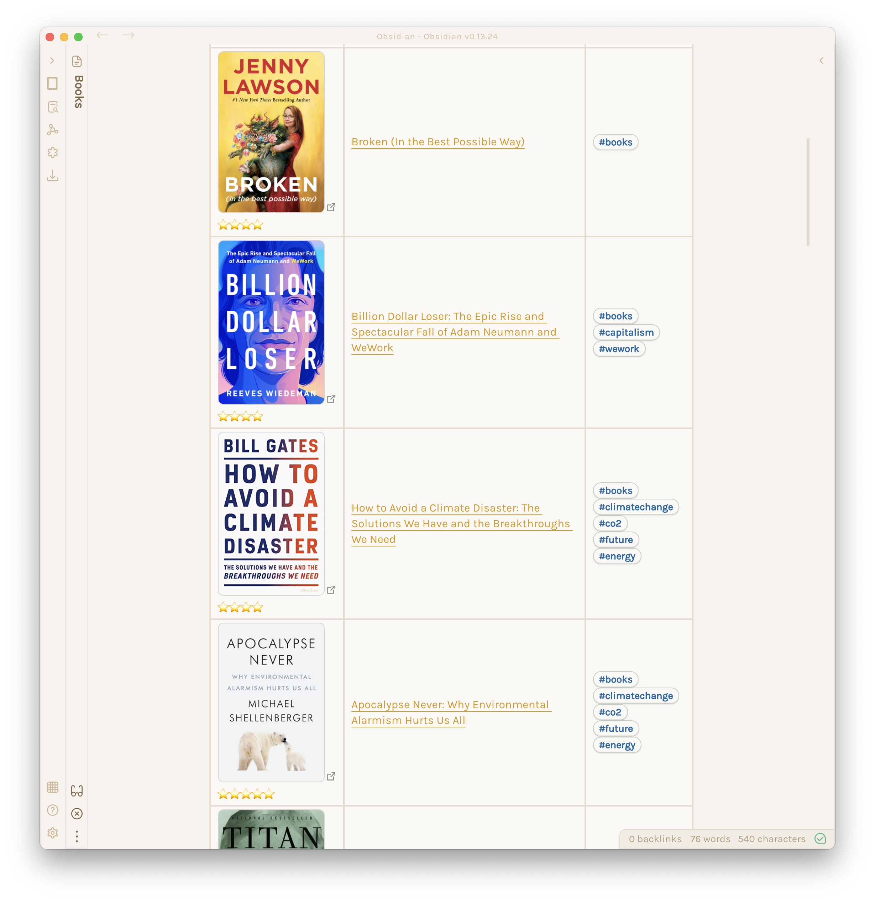

I wanted a way to get covers of books in my Obsidian vault. I decided I wanted to import from Goodreads. Then it was just the matter of finding the RSS feed and scraping.

If you want to use this, you need the following variables in your `.env` file:

```
BOOKS_DIR=/Users/miharekar/Documents/Obsidian/books/
USER_ID=1234
RSS_KEY=5678
```

The first is self-explanatory, and the second and third one you get by going to _My Books_, and in the bottom row selecting _infinite scroll_, copying the RSS URL, and inspecting it for these two vars.

The script then populates your books frontmatter like so:

```
---
isbn: 316461369
title: 'Billion Dollar Loser: The Epic Rise and Spectacular Fall of Adam Neumann and
  WeWork'
author: Reeves  Wiedeman
rating: "⭐️⭐️⭐️⭐️"
image_url: https://i.gr-assets.com/images/S/compressed.photo.goodreads.com/books/1595814305l/54502643.jpg
book_url: https://www.goodreads.com/book/show/54502643
---
```

And then you can do something like:

~~~
```dataview
TABLE WITHOUT ID
  "[](" + book_url + ")" + rating AS Cover,
  "[[" + file.path + "|" + title + "]]" AS Title,
  file.tags AS Tags
FROM "books" AND !"books/extra"
WHERE title
SORT file.ctime DESC
```
~~~

to have it render this:


